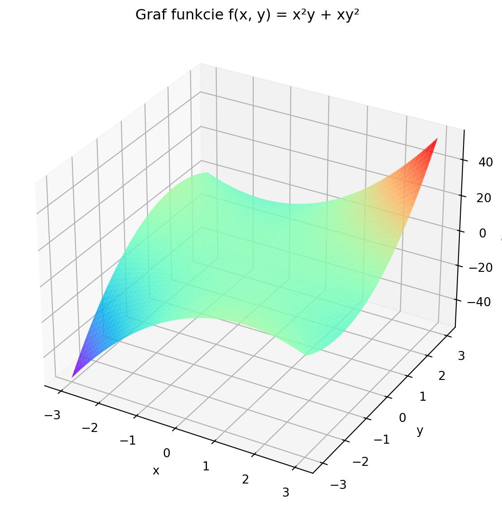
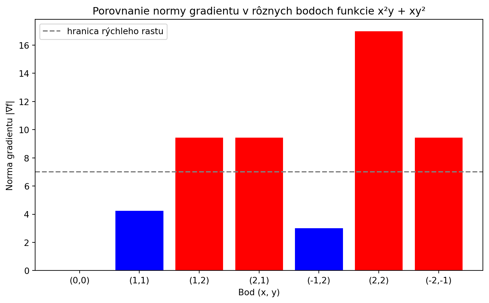

## Motivácia

Gradient patrí medzi kľúčové pojmy matematickej analýzy 
funkcií viacerých premenných.

- **Fyzika** — gradient teploty udáva smer tepelného toku
- **Strojové učenie** — algoritmus gradientného zostupu
- **Optimalizácia** — hľadanie minima a maxima funkcií

## Čo je gradient?

Gradient funkcie $f(x, y)$ je vektor zložený z parciálnych derivácií:

$$
\nabla f(x, y) = \left( \frac{\partial f}{\partial x}, \frac{\partial f}{\partial y} \right)
$$

Gradient má dve dôležité vlastnosti:

- ukazuje smer **najrýchlejšieho rastu** funkcie
- je vždy **kolmý na vrstevnice** funkcie

## Parciálne derivácie

Parciálna derivácia meria rýchlosť zmeny funkcie v smere jednej osi.
Podľa premennej $x$ je definovaná ako:

$$
\frac{\partial f}{\partial x} = \lim_{\Delta x \to 0} \frac{f(x + \Delta x, y) - f(x, y)}{\Delta x}
$$

Pri výpočte podľa $x$ považujeme $y$ za konštantu a naopak.

## Smerová derivácia

Smerová derivácia udáva rýchlosť zmeny funkcie v ľubovoľnom smere $\vec{v}$:

$$
D_{\vec{v}} f = \nabla f \cdot \frac{\vec{v}}{|\vec{v}|}
$$

- $\nabla f$ — gradient v danom bode
- $\frac{\vec{v}}{|\vec{v}|}$ — jednotkový vektor smeru
- Výsledok je skalár — číslo ktoré hovorí ako rýchlo funkcia rastie

## Úloha 1: Gradient funkcie

Vypočítali sme gradient funkcie $f(x, y) = \sqrt{4 + x^2 + y^2}$ v bode $A = (1, 2)$.

Postup:

1. Vypočítame parciálne derivácie
2. Zostavíme vektor gradientu
3. Dosadíme bod $A = (1, 2)$

$$
\nabla f(1, 2) = \left( \frac{1}{3}, \frac{2}{3} \right)
$$

## Úloha 2: Smerová derivácia

Funkcia $f(x, y) = x^2y + xy^2$, bod $B = (1, 2)$, smer $\vec{v} = (3, 4)$.

Postup:

1. Gradient v bode $B$: $\nabla f(1, 2) = (8, 5)$
2. Normalizujeme vektor: $\frac{\vec{v}}{|\vec{v}|} = \left(\frac{3}{5}, \frac{4}{5}\right)$
3. Skalárny súčin:

$$
D_{\vec{v}}f(1, 2) = \frac{44}{5} = 8{,}8
$$

## Vizualizácia funkcie

Povrch funkcie $f(x, y) = x^2y + xy^2$ v 3D priestore.
Farba zodpovedá hodnote funkcie — červená vysoké, modrá nízke hodnoty.

## Analýza normy gradientu

Norma gradientu $|\nabla f|$ udáva rýchlosť zmeny funkcie.
Červené stĺpce — rýchly rast, modré — pomalší rast.

## Záver

- Gradient $\nabla f$ ukazuje smer najrýchlejšieho rastu funkcie
- Smerová derivácia $D_{\vec{v}}f$ meria rýchlosť zmeny v konkrétnom smere
- V bode $(2, 2)$ je norma gradientu najväčšia — $|\nabla f| \approx 16.97$
- Výpočty realizované symbolicky pomocou knižnice `sympy` v Pythone
- Gradient nachádza uplatnenie v optimalizácii, fyzike aj strojovom učení